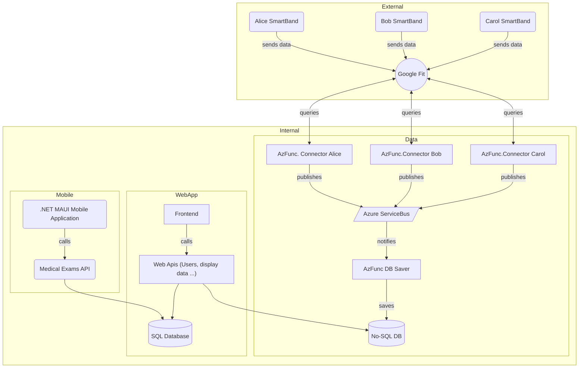

 # Application "Diagram"

AzFunc = Azure function

```mermaid
graph TB;

%% NODES
    DevA(Alice SmartBand)
    DevB(Bob SmartBand)
    DevC(Carol SmartBand)
    
    GFit((Google Fit))

    ConnA[AzFunc. Connector Alice]
    ConnB[AzFunc.Connector Bob]
    ConnC[AzFunc.Connector Carol]

    AzBus[/Azure ServiceBus/]

    DbSaver[AzFunc DB Saver]
    NoSql[(No-SQL DB)];

    MobileApp(.NET MAUI Mobile Application)
    MedApi(Medical Exams API)

    Sql[(SQL Database)]
    Front[Frontend]
    WebApi["Web Apis (Users, display data ...)"]


%% /NODES

%% GRAPH
    subgraph External
        DevA & DevB & DevC-->|sends data|GFit;
    end

    subgraph Internal
        subgraph Data
            GFit <-->|queries| ConnA & ConnB & ConnC
            ConnA & ConnB & ConnC -->|publishes|AzBus
            AzBus-->|notifies|DbSaver
            DbSaver-->|saves|NoSql
        end
        subgraph WebApp
            Front -->|calls| WebApi
            WebApi --> Sql
            WebApi --> NoSql
        end

        subgraph Mobile
            MobileApp-->|calls|MedApi
             MedApi --> Sql
        end
    end 
```

